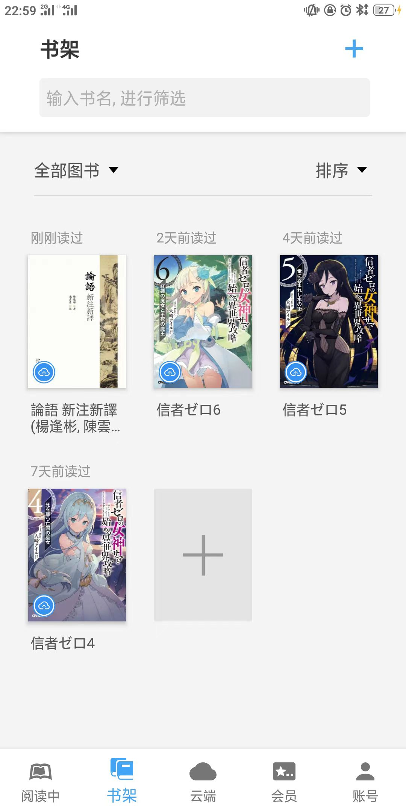

某工科男的读《论语》日志

# 目录
- [目录](#目录)
- [前言](#前言)
- [学而篇](#学而篇)
      - [3.19](#319)
      - [3.20](#320)
      - [3.23](#323)
      - [3.25](#325)
      - [3.26](#326)
- [为政篇](#为政篇)
      - [3.30](#330)
      - [3.31](#331)
- [八佾篇](#八佾篇)
- [里仁篇](#里仁篇)
      - [4.9](#49)
      - [4.12](#412)
      - [4.3](#43)
      - [4.18](#418)
      - [4.19](#419)
- [公治长篇](#公治长篇)
      - [4.21](#421)
- [雍也篇](#雍也篇)
      - [4.22](#422)
- [述而篇](#述而篇)
      - [4.25](#425)
- [泰伯篇](#泰伯篇)
      - [4.26](#426)
      - [4.27](#427)
- [子罕篇](#子罕篇)
- [乡党篇](#乡党篇)
      - [4.28](#428)
- [先进篇](#先进篇)
- [颜渊篇](#颜渊篇)
      - [4.29](#429)
- [子路篇](#子路篇)
- [宪问篇](#宪问篇)
      - [5.2](#52)
- [卫灵公篇](#卫灵公篇)
- [季氏篇](#季氏篇)
      - [5.5](#55)
      - [5.6](#56)
      - [5.7](#57)
      - [5.8](#58)
- [阳货篇](#阳货篇)
      - [5.10](#510)
      - [5.11](#511)
- [微子篇](#微子篇)
- [子张篇](#子张篇)
      - [5.12](#512)
- [尧曰篇](#尧曰篇)
      - [5.13](#513)
      - [5.14](#514)
- [看完](#看完)

# 前言

**顺带一提，这个版本是未修改版**
（因为这里有些话有些阴暗，全部属于我发疯时所作）

**来，背一遍，The Analects，A-N-A-L-E-C-T-S，论语**（背完这一遍我必忘）

（这一段想办法写严肃一点）当成课外书看了，因为正课是读计算机的书。这门课很好但很硬核，不适合我这种在很卷的专业读大学的人（下学期选一些能划水的课；不过我也感觉很幸运能再大一下就选了这节课）。感谢 //XXX 老师的讲课，解读道理的方法真的通俗易懂。

另外是有一次看到我自己的电子书架，感觉这个对比真有意思就供各位一乐。

<!--  -->

（最乐的是我）
注意这里的轻小说全是日语生肉。读论语的同时也在同时读这些。
自己再看一眼这一张图片，我真的是要感叹这是什么神奇的人类多样性。

对了，这篇读书日志最后改成了用markdown编写，我想着哪天记起来发在我的博客上吧。
虽然还没搭建博客就是了（

（前言草稿于5月10日撰写）

# 学而篇

#### 3.19
* 有子曰：其为人也孝弟  
从孝悌看人，可以看出他/她的德性，儒家从千年以前就得出了这个结论，这个道理适用至今。

* 子曰：“巧言令色。”    
“巧言令色”是小人，那么换成是做事呢？无用是小丑，有用是有才。
“巧言令色”之后得来的是人心，或许这是小人得志的原因吧。

#### 3.20
* 子曰：“君子不重 ，則不威；學則不固。主忠信。無友不如己者 。過，則勿憚改 。”  
幼时父母常说“不要和成绩比自己差的人做朋友”，之后发现其他人的家长也这么说，可是两个人总有一个成绩差的，这样大多数人就都没有朋友了。“无友不如己者”肯定不是这个意思，可见孔子在几千年前就能体会到概念的相对性。

#### 3.23

#### 3.25

* 子曰：“不患人之不己知，患不知人也。”  
“知己知彼，百战不殆”同样体现了贵在“知人”的道理。反例有鲁迅笔下的祥林嫂，为博取同情而讲述自己的故事，反而招致他人的捉弄。

#### 3.26
# 为政篇

* 子曰：“吾與回言終日 ，不違，如愚。退而省其私 ，亦足以發，回也不愚。”  
“不违”也不放弃独立思考，不仅是行学生之礼，又能举一反三地学习。

* 子曰：“視其所以，觀其所由，察其所安。人焉廋哉 ？人焉廋哉？”  
春秋，左传，想必就是这么写的吧

* 子曰：“學而不思則罔，思而不學則殆 。”  
> 学习的真理，后半句是我的座右铭。

* 子曰：“攻乎異端，斯害也已。”  
这句话很值得思考。若不学懂，怎么知道是异端？凭借主观臆断不合适，况且不同的人对异端有不同的理解，以谁为参考呢？纠结学与不学的人和学了不少才知道是异端的人，都浪费了不少时间。这是人生的选择。

#### 3.30
为政看完，我真是啥也说不了，想到几个例子就只能证明它的想法是对的，太过时的说法只能让我无语，我看这几篇就顾着点头嗯嗯嗯了:(

#### 3.31
# 八佾篇

八佾（看得我人都傻了）此篇可窥见孔子对礼的看法。传承，是孔子所重视的，比如正统思想，是有理有据的守旧。孔子推行的如今的礼治最终未能做到，不只是因为与当时现实谋权称霸的趋势相反，还因为仅仅是形式上的约束是行不通的，懂礼应教育，诲仁德，做君子。而在儒家学说中，小人当道本就是君子难以对抗的。（儒家就这么暗暗的推出了这个结论，将它久久地传承下去）

# 里仁篇

#### 4.9
* 子曰：“士志於道，而恥惡衣惡食者，未足與議也。”...  

#### 4.12
* 子曰：“放於利而行，多怨。”  
这句就令人疑惑了，或许这里只仅仅受利益驱使的人和事吧。

#### 4.3

#### 4.18
* 子曰：“事父母幾諫，見志不從，又敬不違，勞而不怨。”  
这一句，体现了儒家思想中 下对上的礼仪，臣对王，子对父母，学生对教师，下级对领导，都是这样，至今如此。

#### 4.19
* 子曰：“以約失之者鮮矣。”  
今天就不一样了，有通货膨胀...
> 这里疑似抄错了，就让它在这里吧。。。

* 子曰：“德不孤，必有鄰。”  
到底在哪儿呢？

# 公治长篇

* 子謂子貢曰：“女與回也孰愈 ？”對曰：“賜也何敢望回？回也聞一以知十，賜也聞一以知二。”子曰：“弗如也；吾與女弗如也。”  
6

* 子曰：“始吾於人也，聽其言而信其行；今吾於人也，聽其言而觀其行。於予與改是。”  
这就是知行合一了(doge)

在思想上做加法，行动上就会做减法。

#### 4.21
* 匿怨而友其人，左丘明恥之，丘亦恥之。  
我是 sb...

* 子曰：“已矣乎，吾未見能見其過而内自訟者也。”  
你看看我上面这句？

# 雍也篇

* “子曰：“雍也可使南面。”  
即使有能力，也不一定想成功。

* “原思爲之宰  ，與之粟九百  ，辭。子曰：“毋！以與爾鄰里鄉黨乎！”  
送礼的理由。这句话历史真是悠久[doge]。

* “子曰：“回也，其心三月不違仁，其餘則日月至焉而已矣。”  
仁，真的有这么稀罕吗？

* “冉求曰：“非不説子之道，力不足也。”子曰：“力不足者 ，中道而廢；今女畫  。”  
志向与追求。问出这种问题，要么是不想做，要么就是信念不够坚定。要是真的想去做，就会不顾一切地去想办法达成。

* “子曰：“孟之反不伐 ，奔而殿，將入門，策其馬，曰：‘非敢後也，馬不進也。’”  
真要有人夸他，他这么说岂不是很尴尬。在其他文化里面，反而应该好好接受别人的夸奖。

* “子曰：“質勝文則野 ，文勝質則史。文質彬彬 ，然後君子。”  
这句话说的很好。我的高中语文老师也特别喜欢它。

* “子曰：“中人以上 ，可以語上也；中人以下，不可以語上也。”  
无奈。
不过，值得思考的是，这里说的“中人”，我确实没见过。果然在知识与智商方面也存在马太效应。。。

* “問仁。曰：“仁者先難而後獲，可謂仁矣。”  
连孔子都不能说自己的弟子是否仁，我就更不敢说了。不过我觉得至少我的高中语文老师知道什么是仁。他在讲一些事（古文或者自己的经历）时候，有时我能看到隐藏在其中的无奈与难过。这是孔子说的“难”吗？

* “子曰：“知者樂水，仁者樂山 。知者動，仁者静。知者樂，仁者壽。”  
不懂。好像二者是天然对立的一样。

* “子曰：“觚不觚 ，觚哉！觚哉！”  
用现代汉语读这句是真的搞笑。

* “宰我問曰：“仁者，雖告之曰：‘井有仁焉。’其從之也？”子曰：“何爲其然也？君子可逝也，不可陷也；可欺也，不可罔也。”  
怎么会这么严重呢？这种事情真的无解。君子真的这么纯真吗？君子真的这么脆弱吗？
> 后来我又思考，这几乎是《论语里面》儒家最大的漏洞，孔子最后也避开了这个问题。

* “子曰：“中庸之爲德也，其至矣乎！民鮮久矣。”  
总感觉他自己说的这句和之前的有矛盾。。

#### 4.22
# 述而篇

* “子曰：“德之不修，學之不講，聞義不能徙，不善不能改，是吾憂也。”  
孔子也有焦虑啊。。。

* “子曰：“不憤不啓，不悱不發。舉一隅不以三隅反，則不復也。”  
许多事情也可以这么解释，自助者若有天助之。

<!-- （以下言论皆为我发疯时所作，并不代表我个人的观点）  
不知道为什么，解经的时候总是很难受，总是觉得心很累。既烦躁，又悲伤。
也许是因为我在看这种东西而不是看自己的专业书吧。真的我是想学习了，计算机要学的东西有这么多，我现在又在干什么？我应该去深耕自己的专业，而不是干这些，而不是在水课上看书解经然后在自己记忆的片段里找出些什么然后比照一下随意写一些只能公开发表的言论，憋着一些想说的又说不出的东西，然后又黯然神伤。我真的是想破口大骂了。

这之后有一天，我们讲了韩非子。
这天讲完我心情好了许多，不知道是韩非子说了许多我想说的让我好受许多，还是只是因为今天我的时间表没这么急迫。。 -->

* “子在齊聞《韶》，三月不知肉味，曰：“不圖爲樂之至於斯也。”  
有时候真的觉得音乐是我内心最后一方净土了，本来计算机应该是，可是它混入了我世俗的愿望。

* 子曰：“我非生而知之者，好古，敏以求之者也。”  
巧了我也是，好好地做个“好知者”和“乐知者”。

* 子曰：“仁遠乎哉？我欲仁，斯仁至矣。”  
可是你之前还说除了颜回之外的仁其他弟子说仁只是像日升月落一般的应景罢了。。。

#### 4.25
* 子曰：“若聖與仁，則吾豈敢？抑爲之不厭，誨人不倦，則可謂云爾已矣。”公西華曰：“正唯弟子不能學也。”  
人若是坚定了理想信念，便可以较为容易地进入如孔子所说的状态。立下志向，什么懂礼，惜时这些自然会考虑得到；立志真的是千里之行最重要的一步。

* 子曰：“君子坦蕩蕩，小人長戚戚。”  
可是，在21世纪20年代，东亚“卷”圈的人们至少有三分之一的年轻人患有不同程度的焦虑症或抑郁症(╥_╥)

# 泰伯篇

#### 4.26
* 子曰：“學如不及，猶恐失之。”  
第五次工业革命：是这样的[doge]。

#### 4.27
# 子罕篇
* 子絶四：毋意，毋必，毋固，毋我。  
我倒是有时候抓住一点线索就凭空揣测，然后绝对肯定...

* 子曰：“知者不惑，仁者不憂，勇者不懼。”  
是我还不够智吗？

# 乡党篇

* 就...整篇都讲礼呗  

#### 4.28
# 先进篇

* 子曰：“回也其庶乎？屢空。賜不受命，而貨殖焉，億則屢中。”  
由此可知，做君子不一定能赚钱。

* 子畏於匡，顔淵後。子曰：“吾以女爲死矣。”曰：“子在，回何敢死？”  
这是什么地狱笑话...为颜回默哀三秒..

* 子路使子羔爲費宰。子曰：“賊夫人之子。”子路曰：“有民人焉，有社禝焉，何必讀書，然後爲學？”子曰：“是故惡夫佞者。”  
读书真的很重要。

* 子路、曾晳、冉有、公西華侍坐。  
第二次再见到它，原来这一章讲的是谦虚。

# 颜渊篇

* 司馬牛問仁。子曰：“仁者，其言也訒。”曰：“其言也訒，斯謂之仁已乎？”子曰：“爲之難，言之得無訒乎？”  
有时候我也是这样，想得多了，却不知道怎么说话。

* 司馬牛問君子。子曰：“君子不憂不懼。”曰：“不憂不懼，斯謂之君子已乎？”子曰：“内省不疚，夫何憂何懼？”  
...

#### 4.29

顺带说一下，颜渊篇内容倒是老生常谈了，讲仁，知，讲君子。
# 子路篇

* 仲弓爲季氏宰，問政。子曰：“先有司，赦小過，舉賢才。”  
金句。

* 子路曰：“衛君待子而爲政，子將奚先？”子曰：“必也正名”。  
有些惊讶，正名居然是儒家的说法。

* 冉有曰：“既庶矣，又何加焉？”曰：“富之。”曰：“既富矣，又何加焉？”曰：“教之。”  
这让我想到实现共产主义的条件了。先富后教，在中国，倒是没有实现，改革开放后，教育和经济是同时发展的。可是，你知不知道Indian这个词是谁造的，又是为什么要造这个词呢？

* 子曰：“苟有用我者，期月而已可也，三年有成。”  
* 子曰：“如有王者，必世而後仁。”  
这两句连在一起的意思是，即使是孔子，用尽一生的时间也不能实行仁政[doge]。
用这种方式思考，可以类比马克思的经历，他的巴黎公社最后也没有成功。

# 宪问篇

#### 5.2

* 子曰：“不逆詐，不億不信，抑亦先覺者，是賢乎！”  
我觉得能够怀疑然后不说出来，之后不管能不能被证实，也都不觉得奇怪，就已经很厉害了。

* 或曰：“以德報怨，何如？”子曰：“何以報德？以直報怨，以德報德。”  
经典。

* 子曰：“莫我知也夫！”子貢曰：“何爲其莫知子也？”子曰：“不怨天，不尤人，下學而上達。知我者其天乎！”  

* 子路宿於石門。晨門曰：“奚自？”子路曰：“自孔氏。”曰：“是知其不可而爲之者與？”  
到底是那个守门的人有见识呢，还是说所有人都知道了这件事[doge]。

# 卫灵公篇

* 立則見其參於前也，在輿則見其倚於衡也，夫然後行。”子張書諸紳。  
这种其实不必专门写下来，可以用想象训练来做到，就想象那几个字成天就显示在视线中明显的有单色的位置上（好像屏幕一样），虽然我是不敢这么做[doge]。

* 子曰：“可與言而不與之言，失人；不可與言而與之言，失言。知者不失人，亦不失言。”  
不多言不失言，很难做到T.T

* 子曰：“人無遠慮，必有近憂。”  
这之前一直都是误解了这句话的意思...之前真以为是“焦虑”的虑而不是“考虑”的虑。

* 子曰：“君子病無能焉...  

* 子曰：“知及之，仁不能守之；雖得之，必失之。  
还没开始“得”呢，就已经冒冷汗了，果真是君子言厉。

# 季氏篇

#### 5.5 
* 孔子曰  ：“天下有道，則禮樂征伐自天子出...  
权力的传承难道是依赖于身份地位吗？生而为天子，诸侯，士大夫，前辈的见识与教育不同，影响了对权利的维持。诸侯，士大夫将自己的后代以天子一般对待，却不为他人赞同，毕竟真的天子就在那里。当见识拉开差距，治理若不能完善，能力不足，权利自然会丧失。

#### 5.6
* 孔子曰：“益者三樂，損者三樂。...  
“樂驕樂，樂佚遊，樂晏樂，損矣”，可以发现这些“损”之乐是关于态度的，长期的享乐方式，孔子并没有过度地批判玩乐这一件事，批判的是对于玩乐的态度。李白云游四方，也算是“逸游”吗？转念一想，孔子罢官周游列国，也不能算是“逸游”吧。

#### 5.7
* 孔子曰：“侍於君子有三愆：言未及之而言謂之躁，言及之而不言謂之隱，未見顔色而言謂之瞽。”  
言未及之而不言，我上课就这样：|，该好好反省才是。

* 孔子曰：“見善如不及，見不善如探湯。吾見其人矣，吾聞其語矣。隱居以求其志，行義以達其道。吾聞其語矣，未見其人也。”  
这真可惜了，东晋有陶渊明，“隐居以求其志”，
“行義以達其道”，也有屈原，司马迁，这些人孔子都没办法看到。只能怪在战火纷飞的浮躁社会孔子没有这么好的运气看到罢。

* 齊景公有馬千駟 ，死之日，民無德而稱焉  。伯夷叔齊餓于首陽之下，民到于今稱之。其斯之謂與 ？  
思想与精神是人类祖先留给后代的最宝贵的礼物。
人贵为人，贵在传承。

#### 5.8
* 陳亢問於伯魚曰：“子亦有異聞乎？”...  
很像现在学生与导师，导师为学生指明研究方向。其实，这样的组合对学生的要求真的很高。导师对于学生有充足的信任（或者撒手不管），然后学生自己去学习。佩服孔鲤的自学能力...

# 阳货篇

* 子曰：“性相近也，習相遠也。”  
经典，从小从三字经就记得这句。这句话的道理我不知道思考了多少次。从唯物主义的观点分析“习相远”，又在人的动机上陷入唯物与唯心的矛盾，即使最后总是不了了之，却能让我收获颇丰。

* 子曰：“唯上知與下愚不移。  
呵！斜率为正无穷大的直线与斜率为负无穷大的直线是如此地相近。

* 子之武城，聞弦歌之聲。夫子莞爾而笑，曰：“割雞焉用牛刀？”  
啊？原来是这么来的。这句玩笑很有哲理。也许有时候我觉得多余的课程安排是有意义的。

* 子曰：“夫召我者，而豈徒哉？如有用我者，吾其爲東周乎 ？”  
这个好玩:D   很有自信

#### 5.10
* 子曰：“由也！女聞六言六蔽矣乎？”對曰：“未也。”“居！吾語女。好仁不好學...  
总之就是要学呗，计算机要学的东西真多...(T_T)累啊

* 子曰：“小子何莫學夫詩？詩，可以興 ，可以觀，可以群，可以怨。邇之事父 ，遠之事君；多識於鳥獸草木之名。”  
虽然是这样说，但是有真才实学的人也不专门在诗中学习这些；诗可以成为学习这些知识的引子，比如说通过一首诗而爱上文学之类。

* 子曰：“予欲無言。”子貢曰：“子如不言，則小子何述焉？”子曰：“天何言哉？四時行焉，百物生焉，天何言哉？”  
不知道上下文但是可以知道这里肯定是有故事的[doge]（谁没事说自己无语了...）

#### 5.11
* 子曰：“飽食終日，無所用心，難矣哉！不有博弈者乎？爲之，猶賢乎已。”  
为什么我的rm都是一些整天打游戏的，不好好学习计算机的摆烂家伙...成绩好的也不会搞电脑...别人都已经卷的没边了..

# 微子篇

* 周公謂魯公曰 ：“君子不施其親，不使大臣怨乎不以。故舊無大故，則不棄也。無求備於一人！  
这倒确实。人的性格与所处的环境有关。

# 子张篇

* 子夏曰：“君子有三變：望之儼然，即之也温，聽其言也厲。  
不知道为什么就是觉得很对...

* 子夏曰：“大德不踰閑，小德出入可也。”  
这句有点法治的意思了。

#### 5.12
* 子游曰：“吾友張也爲難能也，然而未仁。”曾子曰：“堂堂乎張也，難與並爲仁矣。”  
感觉子游就是上面所说的“听其言也厉”了。

* 曾子曰：“吾聞諸夫子：人未有自致者也，必也親喪乎！”  
不过，中医学和心理学认为，许多消极的感情憋在心里是要生病的[doge]。

* 孟氏使陽膚爲士師，問於曾子。曾子曰：“上失其道，民散久矣。如得其情，則哀矜而勿喜！”  
可是，干一行爱一行，若没有“喜”，如何得“爱”？强求“哀”，只是给自己加戏罢了。

* 文武之道，未墜於地，在人。賢者識其大者，不賢者識其小者。  
确实，识前路者为贤者。我周围的一些同学还不知道计算机本科专业的前路。果然学习时还是要多了解行业前沿与行业大方向，识其大者，才能更好地促学。

* 子貢曰：“譬之宫牆，賜之牆也及肩，窺見室家之好。夫子之牆數仞，不得其門而入，不見宗廟之美，百官之富。得其門者或寡矣。夫子之云，不亦宜乎！”  
我要是被人这样子骂没见识，都不知道是会生气还是无语。（不过绝对会苦笑:D）

# 尧曰篇

#### 5.13
* 子張曰：“何謂四惡？”子曰：“不教而殺謂之虐；不戒視成謂之暴；慢令致期謂之賊；猶之與人也，出納之吝謂之有司。”  
孔子説：“不教育便殺戮叫做‘虐’；不申誡只看成績叫做‘暴’；起先懈怠，突然限期叫做‘賊’；以給人財物作比方，出手慳吝，就等於把當政者降格爲經管人員了。”
#### 5.14

# 看完

看完这本书，我真是有喜有悲，不知道自己读这本书是不是浪费时间；其实看过上面的日志也知道，论语并没有改变我的思考方式，我宁愿去读我的专业书...
果然还是上课讲的好（毕竟讲了几个朝代的经典）

读这本书真的太费我课外时间了，有这时间一本《深入理解计算机系统》都读完了＼(`Δ')／，咱们计算机的课业本来就繁重...下学期真的一定要选水课！！
至于读四书五经，诸子百家，我觉得可能得等到十年之后了。我会把这篇文章发到我的github上，供十年后回忆吧。

链接https://github.com/curbe454/The-Analects  
(顺带一提这是未修改版:D)

读完圣贤书的我，该开始好好精进技艺了。

5.18.2024